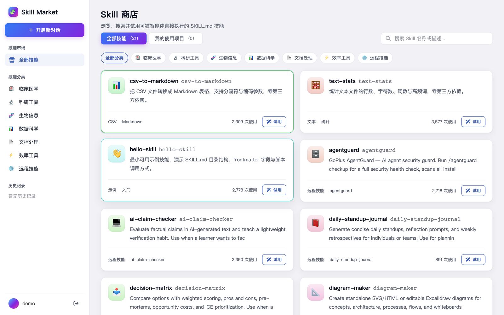
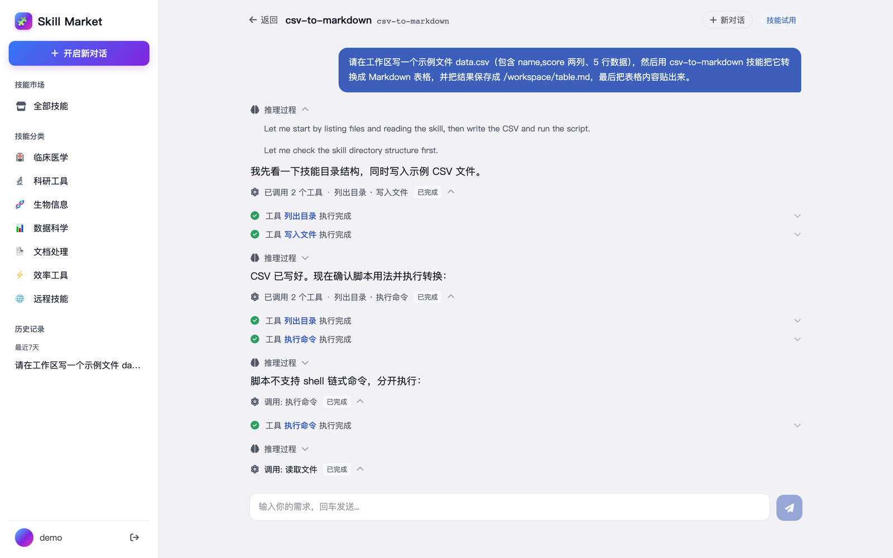
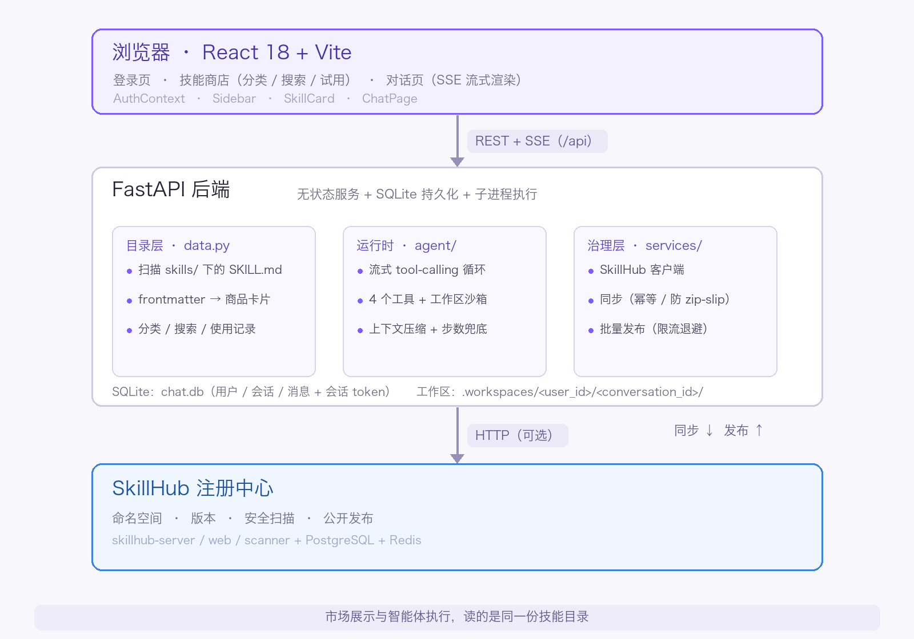
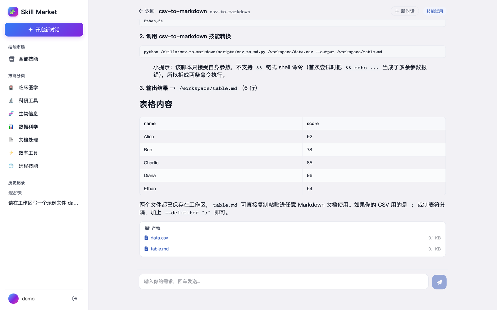
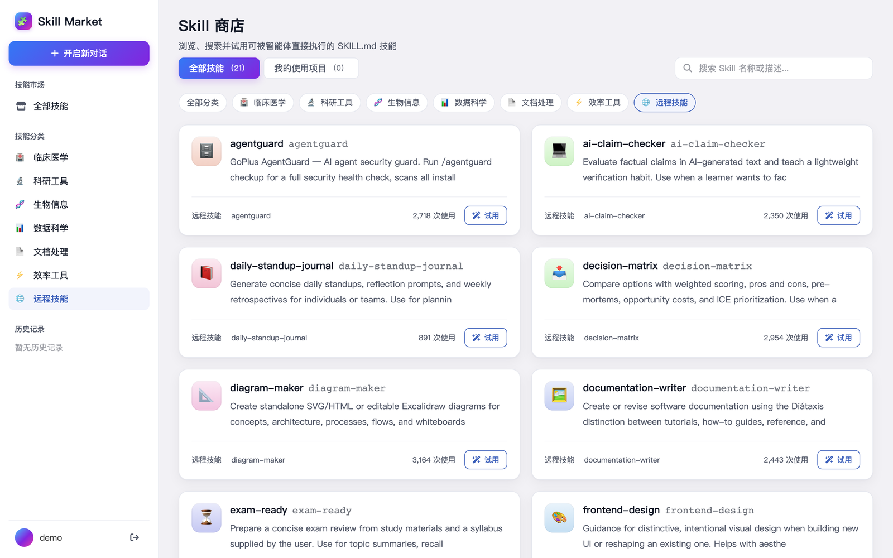

# Skill Market

一个**技能市场 + 智能体运行时**的开源实现：既能像应用商店一样浏览、搜索技能，又能真正**加载并执行**这些技能——用户在对话里让智能体调用某个 skill 的脚本产出结果。

后端用 `FastAPI`，前端用 `React + Vite`。技能以标准 `SKILL.md` 目录组织，启动时自动扫描成市场目录；智能体通过 OpenAI 兼容接口做流式 tool-calling，在工作区沙箱里运行技能脚本。

## 界面预览

| 技能商店 | 智能体对话（推理过程 + 工具调用） |
|---|---|
|  |  |

> 截图为 `./deploy.sh` 全量部署实例：市场里共 21 个技能（3 个内置示例 + 18 个从 SkillHub 同步）。

## 核心能力

| 能力 | 说明 |
|---|---|
| 技能市场 | 扫描 `backend/app/skills/` 下的 `SKILL.md`，自动生成分类、标签、用量、示例问题 |
| 智能体对话 | 流式（SSE）tool-calling：读文件 / 列目录 / 写文件 / 执行命令，带推理过程展示 |
| 工作区沙箱 | 每个会话独立 `workspace`，`/skills/<slug>` 只读、`/workspace` 可写，路径越界拦截 |
| 安全防护 | 危险命令黑名单、子进程超时/输出裁剪、环境变量白名单 |
| 长对话压缩 | 上下文超预算时自动把早期历史压缩成摘要，保证长任务不撑爆模型 |
| 用户隔离 | 用户名登录（无密码），会话历史与工作区产物按用户 + 会话隔离 |
| SkillHub 集成 | 可选：从 [SkillHub](https://github.com/iflytek/skillhub) 注册中心同步技能，也可把本地技能批量发布上去 |

## 架构



一句话概括三层分工：**目录层**（`data.py`）把文件系统变成市场商品，**运行时**（`agent/`）把 `SKILL.md` 变成可执行能力，**治理层**（`services/`）对接 SkillHub 做同步与发布——市场展示和智能体执行读的是同一份技能目录。

<details>
<summary>展开文本版架构图</summary>

```
┌──────────────────────────────────────────────────────┐
│  React 18 (Vite)                                     │
│  LoginPage · SkillStorePage · ChatPage · Sidebar     │
└───────────────┬──────────────────────────────────────┘
                │ REST + SSE(/api)
┌───────────────▼──────────────────────────────────────┐
│  FastAPI                                             │
│  ├─ data.py        市场目录（扫描 SKILL.md）          │
│  ├─ auth.py        用户名登录 + session token         │
│  ├─ routers/       auth · chat                        │
│  ├─ agent/         agent_loop · tools · safety ·     │
│  │                 prompt · skill_index · chat       │
│  ├─ services/      SkillHub 客户端 + 同步/发布（可选）│
│  └─ skills/        技能仓库（SKILL.md + scripts）     │
└───────────────┬──────────────────────────────────────┘
                │ 发布 ↑ ↓ 同步（HTTP，可选）
┌───────────────▼──────────────────────────────────────┐
│  SkillHub 注册中心（技能源 / 治理）                   │
└──────────────────────────────────────────────────────┘
```

</details>

## 技术栈

- **前端**：React 18、Vite 5、react-router-dom 6、marked（Markdown 渲染）+ DOMPurify（XSS 防护）
- **后端**：FastAPI、Uvicorn、Pydantic v2、openai SDK（流式）、SQLite、PyYAML
- **模型**：任意 OpenAI 兼容接口，默认指向阿里云百炼 DashScope 兼容端点（`qwen-plus`）
- **部署**：本地脚本、Docker Compose

## 目录结构

```text
skill-market/
├── backend/
│   └── app/
│       ├── main.py              # 入口：health / skills / categories
│       ├── data.py              # 扫描 skills/ 生成市场目录
│       ├── auth.py              # 用户名登录 + session token（SQLite）
│       ├── routers/             # auth_router · chat_router
│       ├── agent/               # 智能体运行时
│       │   ├── agent_loop.py    # 流式 tool-calling 循环 + 上下文压缩
│       │   ├── tools.py         # 4 个工具 + Workspace 沙箱
│       │   ├── safety.py        # 危险命令黑名单 + 路径校验 + 环境变量白名单
│       │   ├── skill_index.py   # 技能索引（依赖闭包展开）
│       │   ├── prompt.py        # system prompt 拼装
│       │   └── config.py        # 模型与运行配置
│       ├── services/            # SkillHub 集成（可选）
│       │   ├── skillhub_client.py     # 客户端（list / download / labels）
│       │   ├── skillhub_sync.py       # 同步（SkillHub → 本地）
│       │   └── publish_to_skillhub.py # 批量发布（本地 → SkillHub）
│       └── skills/              # 技能仓库：categories.json + <分类>/<技能>/
├── frontend/
│   └── src/
│       ├── pages/               # LoginPage · SkillStorePage · ChatPage
│       ├── components/          # Sidebar · SkillCard
│       └── AuthContext.jsx      # 登录态管理
├── deploy/
│   └── docker-compose.all.yml   # SkillHub + skill-market 合编排（可选）
├── docs/
│   ├── API.md                   # 接口文档
│   ├── architecture.png         # 架构总览图
│   └── screenshot-*.png         # 界面截图（商店 / 对话 / 产物）
├── deploy.sh                    # 一键部署 SkillHub + skill-market（可选）
├── docker-compose.yml           # 单项目 Docker 部署
└── start_backend.sh / start_frontend.sh
```

## 快速开始

### 方式一：本地开发（推荐调试）

```bash
./start_backend.sh     # 启动后端 http://127.0.0.1:8000
./start_frontend.sh    # 启动前端 http://127.0.0.1:5173
```

首次运行会自动建 `.venv` / `npm install`。手动启动见 [start_backend.sh](./start_backend.sh) / [start_frontend.sh](./start_frontend.sh)。

> 智能体对话需要 LLM key：`cp backend/.env.example backend/.env` 并填入 `LLM_API_KEY`。
> 不配置也能浏览市场，只是 `/api/chat` 会返回「未配置 LLM_API_KEY」。

### 方式二：Docker Compose（单项目）

只起 skill-market 自身，技能全部来自本地 `backend/app/skills/` 仓库。

```bash
cp backend/.env.example backend/.env   # 可选：填 LLM_API_KEY 才能用智能体对话
docker compose up -d --build
```

| 服务 | 地址 | 说明 |
|---|---|---|
| 前端 | `http://127.0.0.1:5174` | nginx 静态页 + `/api` 反代 |
| 后端 | `http://127.0.0.1:8001` | `/api/health` 健康检查 |

启动后应看到 2 个容器，后端为 `healthy`：

```bash
docker compose ps
# skill-market-backend-1   Up (healthy)   0.0.0.0:8001->8000/tcp
# skill-market-frontend-1  Up             0.0.0.0:5174->80/tcp
```

### 方式三（可选）：一键部署 SkillHub + Skill Market

把 [SkillHub](https://github.com/iflytek/skillhub) 注册中心作为技能源一起起：

```bash
./deploy.sh
```

会拉取 SkillHub 官方镜像、构建 skill-market、启动后自动同步远程技能，最后打印验证结果。详见 [deploy.sh](./deploy.sh)。

| 服务 | 地址 | 端口映射 |
|---|---|---|
| **Skill Market 前端** | `http://127.0.0.1:5174` | 5174 → 80 |
| **Skill Market API** | `http://127.0.0.1:8001` | 8001 → 8000（`/api/health`） |
| SkillHub Web UI | `http://127.0.0.1:18081` | 18081 → 80（`admin` / `change-me-local-demo`） |
| SkillHub API | `http://127.0.0.1:18080` | 18080 → 8080（`/actuator/health`） |
| SkillHub 安全扫描器 | — | 18000 → 8000 |
| SkillHub PostgreSQL | — | 15432 → 5432 |
| SkillHub Redis | — | 16379 → 6379 |

启动完成后应为 7 个容器全部 `healthy`：

```bash
docker compose -f deploy/docker-compose.all.yml ps
```

```
skillhub-demo-skillhub-postgres-1      Up (healthy)   15432->5432
skillhub-demo-skillhub-redis-1         Up (healthy)   16379->6379
skillhub-demo-skillhub-scanner-1       Up (healthy)   18000->8000
skillhub-demo-skillhub-server-1        Up (healthy)   18080->8080
skillhub-demo-skillhub-web-1           Up (healthy)   18081->80
skillhub-demo-skillmarket-backend-1    Up (healthy)   8001->8000
skillhub-demo-skillmarket-frontend-1   Up             5174->80
```

同步成功后市场里会出现「远程技能」分类：SkillHub 自带默认技能 18 个，加上本仓库内置的
3 个示例技能，共 21 个。想确认：

```bash
curl -s http://127.0.0.1:8001/api/skills | python3 -c \
  "import sys,json; print('技能总数:', len(json.load(sys.stdin)['items']))"
```

> 干净部署只会同步 SkillHub 的**自带默认技能**（`builtin-skill-publisher` 种子）。
> 如果你之前往这个 SkillHub 实例发布过自己的技能，它们会留在数据卷里一起被同步进来；
> 想恢复到「只有自带默认技能」的状态，重置数据卷即可：
>
> ```bash
> ./deploy.sh --down -v && ./deploy.sh
> ```
>
> 注意 `-v` 会同时清空市场侧的历史（`chat.db`、工作区产物卷）。

### 停止与切换（方式二 / 方式三互斥）

⚠️ **两套编排都占用 `8001` 和 `5174`，不能同时启动**，切换前必须先停掉当前这套，否则会报端口占用。

```bash
# 停止单项目栈（compose 项目名 skill-market）
docker compose down          # 加 -v 连数据卷一起删

# 停止全量栈（compose 项目名 skillhub-demo）
./deploy.sh --down           # 加 -v 连数据卷一起删
./deploy.sh --logs           # 跟踪日志
```

互相切换：

```bash
# 单项目 → 全量
docker compose down
./deploy.sh

# 全量 → 单项目
./deploy.sh --down
docker compose up -d
```

> 全量栈的数据在独立卷里（`skillhub_pg` / `skillhub_redis` / `skillhub_storage` / `backend_data` / `backend_workspaces`），
> 不加 `-v` 的 `down` 不会删除它们，重启后 SkillHub 数据库与已发布的技能都还在。
> SkillHub 首次启动（Spring Boot 建库 + 扫描器就绪）需要 1～2 分钟，`deploy.sh` 自带等待。

## 页面说明

| 页面 | 路由 | 说明 |
|---|---|---|
| 登录页 | `/`（未登录） | 输入用户名即可登录（无密码） |
| 技能商店 | `/` | 分类筛选、搜索、`全部 / 我的使用项目` 两个 tab，技能卡片带「试用」示例问题 |
| 对话页 | `/chat/:slug` | 针对某个技能的智能体对话：流式回复 + 推理过程 + 工具调用 + 产物下载 |

对话页底部的「产物」区，会把智能体在工作区里真实写出的文件列出来，可直接下载：



## 技能格式

技能是标准 `SKILL.md` 目录：

```text
backend/app/skills/<分类>/<技能名>/
├── SKILL.md          # frontmatter：name / description / keywords；正文写使用说明
├── _meta.json        # 可选：slug / version / examples / dependencies / max_steps / requires
├── scripts/          # 可执行脚本
└── references/       # 可选：参考文档
```

```markdown
---
name: my-skill
description: 一句话说明这个技能做什么。
keywords:
  - 关键词一
  - 关键词二
---

# my-skill

详细说明：什么时候用、怎么用、参数是什么、输出什么。
```

内置了 3 个零依赖示例技能（`hello-skill`、`text-stats`、`csv-to-markdown`），可以直接阅读它们了解目录结构，也可以照着自己加一个目录——重启后端即可在市场上看到。

技能分类在 `backend/app/skills/categories.json` 里定义；`path` 字段可让分类指向自定义目录名（例如 `_remote` 用于存放从 SkillHub 同步的技能）。

## SkillHub 集成（可选）

把技能统一托管在 [SkillHub](https://github.com/iflytek/skillhub) 注册中心后，skill-market 可以：

- **同步**：启动时把 SkillHub 上的公开技能拉到 `backend/app/skills/_remote/<namespace>/<slug>/`，市场出现「远程技能」分类，智能体也能直接调用。
- **发布**：把本地 `skills/` 下的技能批量上传到 SkillHub（幂等）。

同步完成后，从 SkillHub 拉下来的技能会统一归入「远程技能」分类：



| 环境变量 | 说明 |
|---|---|
| `SKILLHUB_URL` | SkillHub 地址（不配则跳过同步） |
| `SKILLHUB_TOKEN` | API token（公开技能不需要） |
| `SKILLHUB_SYNC_NAMESPACES` | 只同步指定命名空间，逗号分隔 |
| `SKILLHUB_SYNC_LIMIT` | 最多拉取 N 个（0 = 不限） |
| `SKILLHUB_SYNC_FORCE` | `true` 强制重新下载 |

```bash
# 同步（SkillHub → 本地）
python -m app.services.skillhub_sync

# 批量发布（本地 → SkillHub）
python3 backend/app/services/publish_to_skillhub.py --registry http://localhost:18080
python3 backend/app/services/publish_to_skillhub.py --only hello-skill --dry-run
```

> 发布前 SkillHub 会做安全扫描：含硬编码密钥（token/key）的技能会被拦截，需先脱敏成环境变量读取。

## API 概览

完整接口文档见 [docs/API.md](./docs/API.md)。当前接口：

**市场（无需鉴权）**

- `GET /api/health`
- `GET /api/categories`
- `GET /api/skills?search=&tab=&category=`
- `GET /api/skills/{slug}`

**认证**

- `POST /api/auth/login` — `{username}` → `{token, user}`
- `GET /api/auth/me`
- `POST /api/auth/logout`

**对话（需 `Authorization: Bearer <token>`，图片等场景可用 `?token=` 兜底）**

- `POST /api/chat` — SSE 流式，事件：`text` / `reasoning` / `tool` / `error` / `done`
- `POST /api/chat/stop`
- `GET /api/chat/history?slug=&conversation_id=`
- `GET /api/chat/conversations`
- `GET /api/chat/artifacts` / `GET /api/chat/artifact?path=`

## 配置（环境变量）

| 变量 | 默认 | 说明 |
|---|---|---|
| `LLM_API_KEY` | — | OpenAI 兼容接口密钥（兼容 `DASHSCOPE_API_KEY`） |
| `LLM_BASE_URL` | DashScope 兼容端点 | 模型服务地址 |
| `LLM_MODEL` | `qwen-plus` | 模型名 |
| `AGENT_MAX_STEPS` | `100` | 单次对话最大执行步数（安全网） |
| `SUMMARY_TRIGGER_CHARS` | `60000` | 触发历史压缩的上下文字符数 |
| `SUMMARY_KEEP_MESSAGES` | `8` | 压缩时保留的最近消息数 |
| `SKILL_ENV_PASSTHROUGH` | — | 额外透传给技能脚本的环境变量名（逗号分隔） |

> 技能脚本只能读到 `agent/safety.py` 白名单里的环境变量（模型 key、SkillHub 变量），
> 或用 `SKILL_ENV_PASSTHROUGH` 显式追加，其余宿主机环境变量不会下发。

## 数据持久化

- 对话历史与 session：`backend/data/chat.db`（SQLite）
- 智能体工作区产物：`backend/.workspaces/<user_id>/<conversation_id>/`
- Docker 下对应卷：`backend_data`、`backend_workspaces`

## 测试

```bash
# 后端单测（TestClient，不需要大模型）
cd backend && source .venv/bin/activate && pip install -r requirements-dev.txt && pytest

# 前端 E2E（Playwright，自动拉起 dev server 并 mock 后端）
cd frontend && npm install && npx playwright install chromium && npx playwright test

# 部署实例的端到端测试（默认打 http://127.0.0.1:8000，可用 SM_BASE_URL 覆盖）
cd backend && source .venv/bin/activate
pytest ../test -m "not llm"      # 跳过需要大模型的用例

# 打 Docker 部署（方式二 / 方式三的 API 都在 8001，前端在 5174）
SM_BASE_URL=http://127.0.0.1:8001 SM_FRONTEND_URL=http://127.0.0.1:5174 \
  pytest ../test -m "not llm"
```

> 端到端测试默认只覆盖 API；若部署在同一域名下也提供前端静态页，
> 额外设置 `SM_FRONTEND_URL` 即可启用首页用例。
> Docker 部署下 `SM_FRONTEND_URL` 填 `http://127.0.0.1:5174`（nginx 会把 `/api` 反代到后端）。

## 安全说明

- 登录采用「仅用户名」轻量方案，**不做密码校验**，适合本地/内网演示；面向公网部署前请替换为真实鉴权。
- 后端默认开启宽松 `CORS` 方便前后端分离开发，生产环境请收敛 `allow_origins`。
- 智能体的 `run_command` 在容器/宿主机本地运行，只做黑名单与路径约束，**不是完整沙箱**；生产环境请配合容器或独立执行环境隔离。

## 致谢

信息架构参考了 [SkillHub](https://github.com/iflytek/skillhub)（技能注册中心）的设计。
